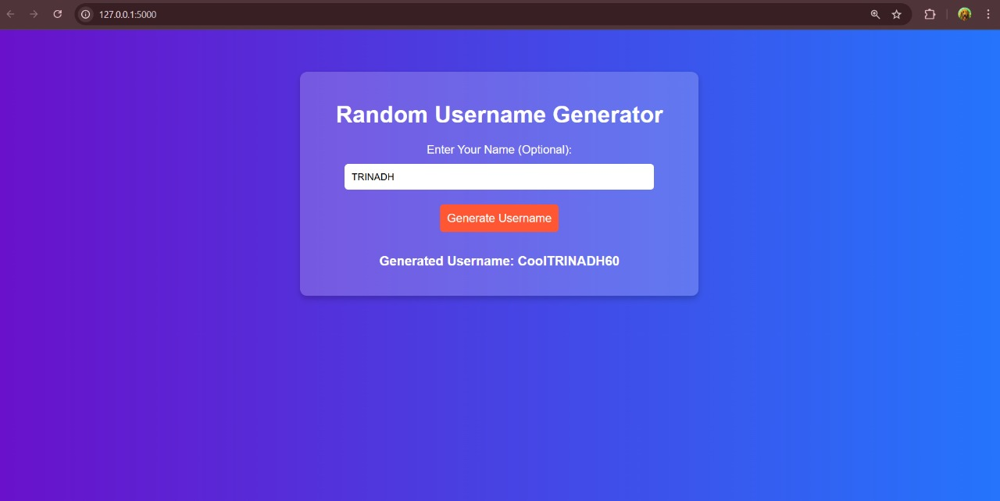
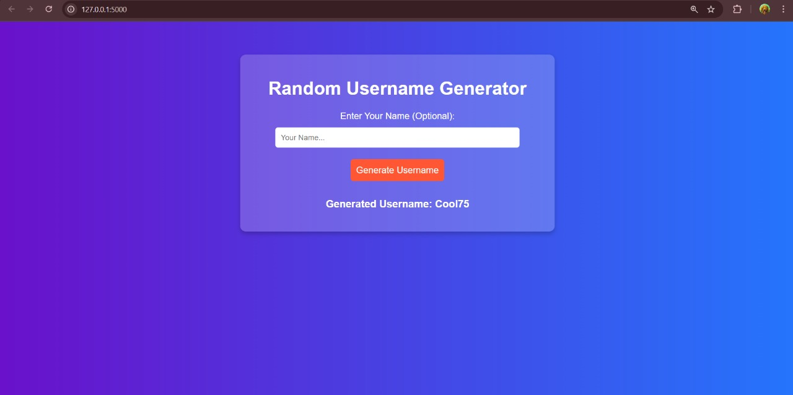

## 🚀 Random Username Generator Web App
## 📌 Project Description
This is a web-based Random Username Generator that allows users to generate unique usernames dynamically. The usernames are created using a combination of an adjective, a random number, and an optional name provided by the user.

## 🌟 Features
✅ User-friendly interface
✅ Option to enter a name (optional)
✅ Automatically adds an adjective and a number to the username
✅ Works seamlessly with Flask backend
✅ Beautiful UI with CSS styling

## 🖥️ Tech Stack
Frontend: HTML, CSS, JavaScript

Backend: Flask (Python)

Styling: CSS

Deployment: Flask (Locally for now)

## 📸 Screenshots

### With Name

### Without Name

## 🚀 How to Run Locally  

1️⃣ **Clone the Repository:**  

git clone https://github.com/your-username/Random-Username-Generator.git
cd Random-Username-Generator

2️⃣ Install Dependencies:
pip install -r requirements.txt

3️⃣ Run the Flask App:
python app.py

4️⃣ Open in Browser:

Visit: http://127.0.0.1:5000/

🔗 GitHub Repository
📌 GitHub Repo

📬 Contact Me
📧 Email: grandhisilatrinadh@gmail.com
🔗 LinkedIn: Trinadh Grandhisila
🔗 LinkedIn Profile Link: https://www.linkedin.com/in/trinadh-grandhisila-92b7202a5

## GitHub Repository

You can find the complete project on GitHub:  
[Random Username Generator](https://github.com/trinadhe3/Random-Username-Generator.git)

